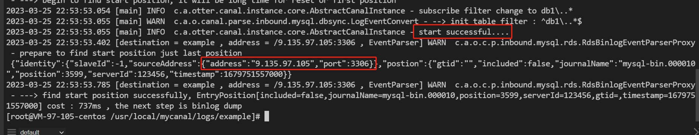

# 一、目标
订阅mysql的binlog日志，实现mysql进行增、删、改的时候，能实时同步更新redis缓存，实现双写一致性。

# 二、环境准备
## 1、腾讯云服务器
主要用来安装mysql和部署canal服务端，canal是java写的，所以需要安装java8的环境。
## 2、本地redis
本来redis也想安装在腾讯云服务器上，但是遇到了一个坑，腾讯云对外暴露端口有安全限制，比如说6379就列入了高危端口，虽然可以换端口号，但是换了端口还要查看端口是否能对外暴露，所以还是简单点，采用本地的redis。

# 搭建步骤
## 1、mysql环境准备
### a.查看mysql版本
使用的mysql版本是5.7.24，一般高于这个版本的都是可以的。

### b.查看二进制日志文件及当前的偏移量

### c.查看mysql是否开启logbin的写入功能

这里默认是开启的，如果没有开启，按照下面方式开启。
更改mysql配置，然后重启，主要关注下面三个配置。

### d.授权canal连接mysql账号
~~~
DROP USER IF EXISTS 'canal'@'%';
CREATE USER 'canal'@'%' IDENTIFIED BY 'canal';  
GRANT ALL PRIVILEGES ON *.* TO 'canal'@'%' IDENTIFIED BY 'canal';  
FLUSH PRIVILEGES;
~~~

## 2、部署canal服务端
### a.java环境检查
canal服务是由java编写的，所以先要检查是否安装java环境，如果没有则需要安装。

### b.下载
~~~
https://github.com/alibaba/canal/releases
~~~

### c.上传并解压

### d.配置instance.properties
~~~
# 注意路径是
/usr/local/mycanal/conf/example
~~~
配置mysql主机ip和端口：

配置canal登录账号：

### e.启动服务
~~~
在路径/usr/local/mycanal/bin，执行startup.sh
~~~

### f.查看日志验证是否成功
查看logs路径下两个日志文件。

## 3、canal客户端开发
### a.下载
~~~
https://github.com/alibaba/canal/wiki
~~~

### b.改造自己的代码
监听单库多表或者单库单表

加入redis操作的代码
~~~
func delRedis(c *redis.Client, columns []*pbe.Column) {
	for _, col := range columns {
		if col.GetName() == "id" {
			c.Del(col.GetValue())
		}
	}
}

func setRedis(c *redis.Client, columns []*pbe.Column) {
	var key string
	var value string
	for _, col := range columns {
		if col.GetName() == "id" {
			key = col.GetValue()
		} else if col.GetName() == "name" {
			value = col.GetValue()
		}
	}
	c.Set(key,value,-1)
}
~~~

## 4、演示效果
### a.在数据库里面插入一条数据
~~~
INSERT INTO `db1`.`tb01`(`id`, `name`) VALUES (9, '999');
~~~
程序控制台打印

此时在redis里面也会添加一条记录

### b.修改一条记录
~~~
UPDATE `db1`.`tb01` SET `id` = 9, `name` = '999999' WHERE `id` = 9 AND `name` = '999' LIMIT 1;
~~~
程序控制台打印

redis里面的数据也更新了

### c.删除一条数据
~~~
DELETE FROM `db1`.`tb01`  WHERE `id` = 9 ;
~~~
程序控制台打印

redis同步更新

完结散花！！！